<div align="center">

<!-- HERO BANNER -->


<!-- TYPING ANIMATION -->
<a href="https://github.com/Ankan0503">
  
</a>

<br/>

<!-- PROFILE VIEWS & SOCIAL BADGES -->
<p>
  
  <a href="https://github.com/Ankan0503?tab=followers">
    
  </a>
</p>

</div>

---

<!-- ABOUT ME -->
<div align="center">

## 🌌 About Me

</div>

```typescript
const ankan = {
  username:   "Ankan0503",
  role:       "Full Stack Developer",
  location:   "Kolkata, West Bengal 🇮🇳",
  timezone:   "IST (UTC+5:30)",

  currently:  ["Building something cool 🚀", "Learning every day 📚"],
  askMeAbout: ["Web Dev", "APIs", "System Design", "Open Source"],

  philosophy: "Code is poetry — write it beautifully.",
  funFact:    "I believe bees & sunflowers > plain green squares 🌻🐝"
};
```

---

<!-- SUNFLOWER GARDEN - AUTO GENERATED -->
<div align="center">

## 🌻 My Contribution Garden

> *Each flower represents a day. The fuller the bloom, the more commits that day.*
> *Watch the bees 🐝 — they know where the work happened!*

<!-- BEE + SUNFLOWER ANIMATION - Generated daily by GitHub Actions -->


<details>
<summary>🌱 How to read this garden?</summary>

| Flower | Commits |
|--------|---------|
| 🟤 Bare soil | 0 commits |
| 🌱 Sprout | 1–2 commits |
| 🌼 Small bloom | 3–5 commits |
| 🌻 Full sunflower | 6–9 commits |
| ✨ Giant sunflower | 10+ commits |

Bees 🐝 land on flowers proportional to activity — more bees = more commits!

</details>

</div>

---

<!-- TECH STACK -->
<div align="center">

## 🛸 Tech Universe

</div>

<div align="center">

**Frontend**


**Backend**


**DevOps & Tools**


</div>

---

<!-- GITHUB STATS -->
<div align="center">

## 📊 GitHub Stats


</div>

---

<!-- ACTIVITY GRAPH -->
<div align="center">

## 📈 Activity


</div>

---

<!-- FOOTER -->
<div align="center">


*"The best time to plant a tree was 20 years ago. The second best time is now."*

⭐ **If you like what you see, consider leaving a star on something!** ⭐

</div>
