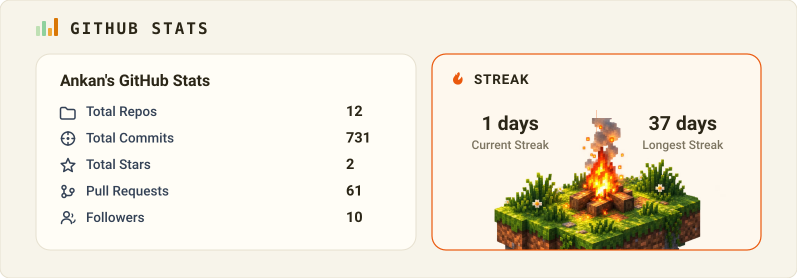
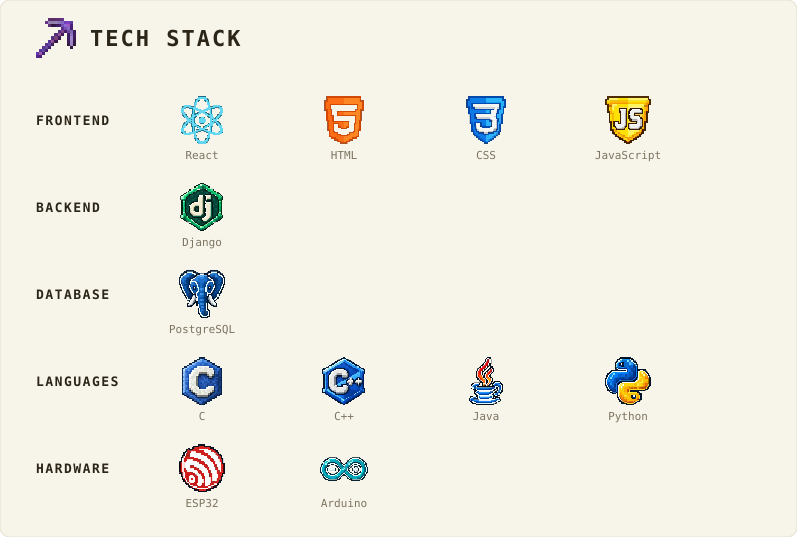
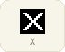

<!-- PIXEL MOSAIC - AUTO GENERATED DAILY BY GITHUB ACTIONS -->

<!-- GITHUB STATS - AUTO GENERATED DAILY BY GITHUB ACTIONS -->

<!-- TECH STACK -->

<!-- SOCIALS -->
<table border="0" cellspacing="10" cellpadding="0"><tr>
<td></td>
<td></td>
<td></td>
<td></td>
</tr></table>

