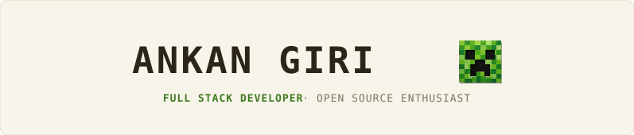
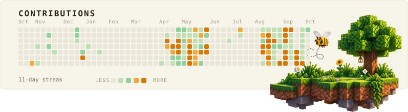
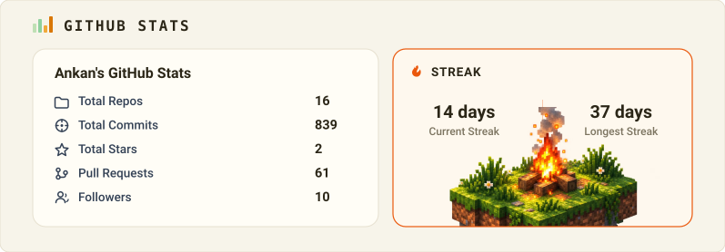
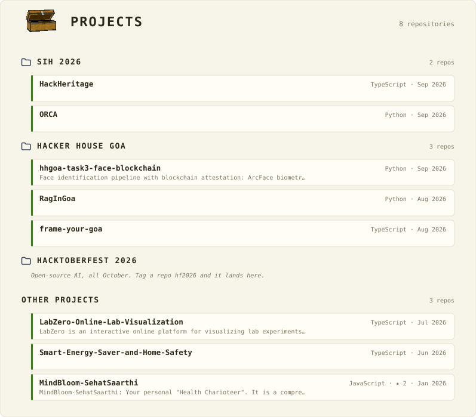
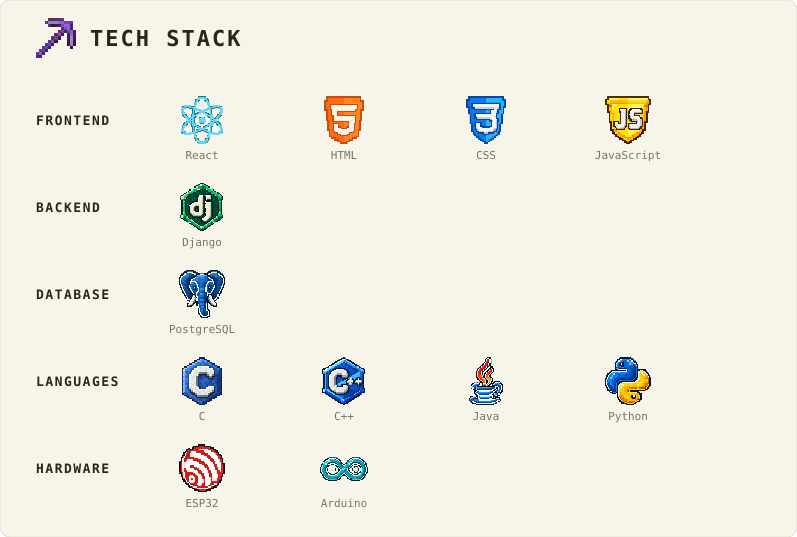
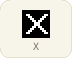

<!-- PIXEL MOSAIC - AUTO GENERATED DAILY BY GITHUB ACTIONS -->

<!-- GITHUB STATS - AUTO GENERATED DAILY BY GITHUB ACTIONS -->

<!-- shelf:start -->

<!-- PROJECTS - AUTO GENERATED BY GITHUB ACTIONS -->

&nbsp;open a project&nbsp;

<b>SIH 2026</b>

· <a href="https://github.com/Ankan0503/HackHeritage">HackHeritage</a> 
· <a href="https://github.com/Ankan0503/ORCA">ORCA</a> 

<b>Hacker House Goa</b>

· <a href="https://github.com/Ankan0503/frame-your-goa">frame-your-goa</a> 
· <a href="https://github.com/Ankan0503/hhgoa-task3-face-blockchain">hhgoa-task3-face-blockchain</a> 
· <a href="https://github.com/Ankan0503/RagInGoa">RagInGoa</a> 

<b>Hacktoberfest 2026</b>

· <a href="https://github.com/Ankan0503/repo-shelf">repo-shelf</a> 

<b>Other projects</b>

· <a href="https://github.com/Ankan0503/LabZero-Online-Lab-Visualization">LabZero-Online-Lab-Visualization</a> 
· <a href="https://github.com/Ankan0503/Smart-Energy-Saver-and-Home-Safety">Smart-Energy-Saver-and-Home-Safety</a> 
· <a href="https://github.com/Ankan0503/MindBloom-SehatSaarthi">MindBloom-SehatSaarthi</a> 

<!-- shelf:end -->

<!-- TECH STACK -->

<!-- SOCIALS -->
<table border="0" cellspacing="10" cellpadding="0"><tr>
<td></td>
<td></td>
<td></td>
<td></td>
</tr></table>

